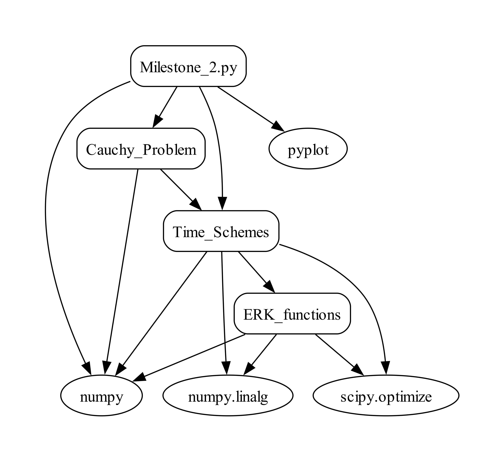

# AM1_Orbits Repository
Author: Sofía Mesón Pérez

---

This repository contains all the Python programs that I have developed for the  *Milestones 2* to *6*, (as the *Milestone 1* is the same as the *Milestone 2* but without implementing fuctions, making it suboptimal.

---
## FILE STRUCTURE

This repository is divided into different files. All the Python programs have a small explanation inside of them, with their inputs and outputs. The code is also commented so that the user can understand it seamlessly. The **Milestones 1-6** file's structure is:

1. **Milestone_Software_Design**: this file contains all the schemes for *Milestones 2* to *6*.
   
2. **ODEs**: this file contains the programs:
   - *Cauchy_Problem.py*: it contains the function that integrates the Cauchy problem, which can be achieved using different temporal schemes.
   - *Stability_Regions.py*: it contains a function that calculates the stability regions for different temporal schemes, as well as a function to plot them.
   - *Time_Schemes.py*: it contains the functions that define the temporal schemes used to integrate the Cauchy problem.

3. **Physics**: this file contains the programs:
   - *CR3BP.py*: it contains the function that defines the circular restriced 3-body problem
   - *Dynamic_Systems.py*: it contains a function that defines different dynamic systems.
   - *ERK_functions.py*: it contains the functions that are used to define the embedded Runge-Kutta temporal scheme.
   - *Kepler.py*: it contains the function that represents differential operator in a Kepler orbit.
   - *Lagrange_Points*: it contains the functions that calculate Lagrange points and their stability.
   - *Nbody_functions.py*: it contains the function that characterizes the N body problem with pointers.
   - *Oscillator.py*: it contains the function that represents the  differential operator of the harmonic oscillator system.

 

  

