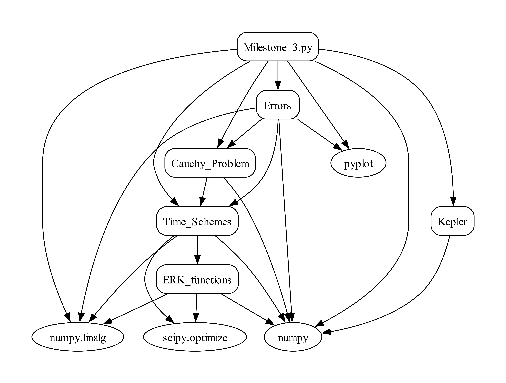
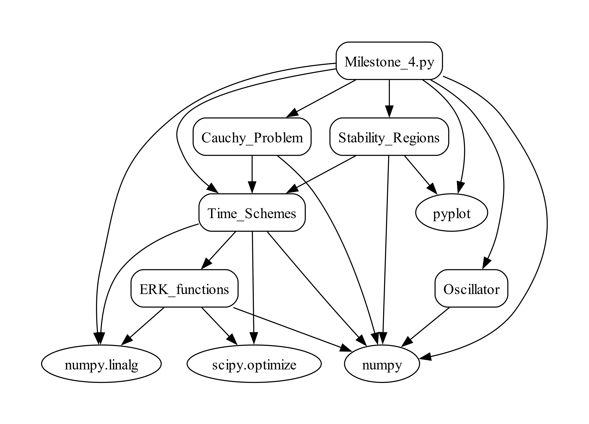
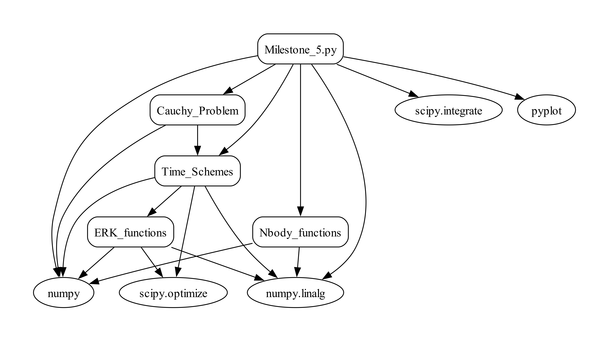
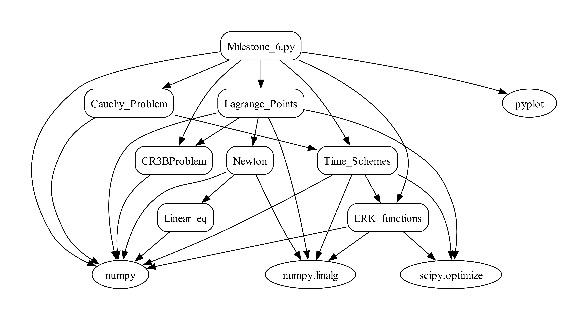

# Milestones 1-6
Course: Ampliación de Matemáticas 1
Author: Sofía Mesón Pérez

---

This repository contains all the Python programs that I have developed for the  *Milestones 2* to *6*, (as the *Milestone 1* is the same as the *Milestone 2* but without implementing fuctions, making it suboptimal.

---
## FILE STRUCTURE

This repository is divided into different files. All the Python programs have a small explanation inside of them, with their inputs and outputs. The code is also commented so that the user can understand it seamlessly. The **Milestones 1-6** file's structure is:

1. **Milestone_Software_Design**: this file contains all the schemes for *Milestones 2* to *6*.
   
2. **ODEs**: this file contains the programs:
   - [*Cauchy_Problem.py*](ODEs/Cauchy_Problem.py): it contains the function that integrates the Cauchy problem, which can be achieved using different temporal schemes.
   - [*Stability_Regions.py*](ODEs/Stability_Regions.py): it contains a function that calculates the stability regions for different temporal schemes, as well as a function to plot them.
   - [*Time_Schemes.py*](ODEs/Time_Schemes.py): it contains the functions that define the temporal schemes used to integrate the Cauchy problem.

3. **Physics**: this file contains the programs:
   - [*CR3BP.py*](Physics/CR3BProblem.py): it contains the function that defines the circular restriced 3-body problem
   - [*Dynamic_Systems.py*](Physics/Dynamic_systems.py): it contains a function that defines different dynamic systems.
   - [*ERK_functions.py*](Physics/ERK_functions.py): it contains the functions that are used to define the embedded Runge-Kutta temporal scheme.
   - [*Kepler.py*](Physics/Kepler.py): it contains the function that represents differential operator in a Kepler orbit.
   - [*Lagrange_Points*](Physics/Lagrange_Points.py): it contains the functions that calculate Lagrange points and their stability.
   - [*Nbody_functions.py*](Physics/Nbody_functions.py): it contains the function that characterizes the N body problem with pointers.
   - [*Oscillator.py*](Physics/Oscillator.py): it contains the function that represents the  differential operator of the harmonic oscillator system.

4. **Systems_of_equations**: this file contains the programs (these programs were developed by Juan A. Hernández):
   - [*Linear_eq.py*](Systems_of_equations/Linear_eq.py): it contains the function for solving linear equations using Gauss
   - [*Newton.py*](Systems_of_equations/Newton.py): it contains the functions for the Newton solver and the Jacobian.
     
5. [**Errors.py**](Errors.py): this module defines two functions to calculate the error of the Cauchy problem programmed in the *Milestone 2* and the convergence rate of the obtained solution.

6. **Milestones 2-6**: Detailed explanations for each milestone are provided in the following section, along with a schematic representation of the functions they utilize.

## MILESTONES EXPLANATION

- [**Milestone 2**](Milestone_2.py): "_Prototypes to integrate orbits with functions_"
  
  In this program, the Cauchy problem is integraed using different time schemes. By only changing the time steps, it becomes clear that the Euler and inverse Euler temporal schemes require smaller dt (approximately of 0.001) to close the orbit and correctly integrate it.
  
  Runge-Kutta and Crank-Nicolson solve the orbit correctly, providing a close and precise orbit for each of the dt provided. Smaller dt imply more precision, but with bigger dt they provide a good integration.
  
 

  

- [**Milestone 3**](Milestone_3.py): "_Error estimation of numerical solutions_"

   By utilizing two grids it is possible to estimate the error of the integration of the Cauchy problems for different time schemes. Observing the results, it becomes clear that both Euler and inverse Euler have a first-order truncation error, Crank-Nicolson has a second-order truncation error and Runge-Kutta Order 4 a four-order truncation error. The same occurs with the convergence rate.

   A higher convergence rate means that the temporal scheme can achieve a more accurate solution with a coarser grid or larger time step compared to methods with lower convergence rates.

  Crank-Nicolson and Runge-Kutta order 4 methods se discretization, which may introduce errors if the time step is not small enough.

  Future work for this program would be to try the estimation of the error and the convergence rate for other grids and see if it changes for the better.

   It is recommended that the user utilizes the same number of steps and step size than the ones used in the *Milestone 2* to have a more accurate perception of how the temporal schemes evolve.
 

  

- [**Milestone 4**](Milestone_4.py): "*Linear problems. Regions of absolute stability*"

   The results are plotted for the initial conditions that provide clear plots for the stability regions.

   When observing the results, it becomes clear that:
  
   - _Euler_: the Euler scheme's absolute stability region is a circumference with the center at (-1, 0) and with r=1. The eigenvalues fall on the imaginary axis, outside of the absolute stability region, so the Euler temporal scheme is not stable.

   - _Inverse Euler_: the eigenvalues are inside of the absolute stability region, specifically in the yellow circumference in the plot (with center (1, 0) and r=1). The numeric solution is stable, as well as the system.

   - _Crank-Nicolson_: the absolute stability region is the negative real half-plane, which makes the system stable. The eigenvalues fall on the imaginary axis.

   - _Runge-Kutta order 4_: the absolute stability region is quite peculiar, as some of its stability regions are contained in the positive real half-plane. The solutions fall on the contour of the stability region, in the imaginary plane.

 

  

- [**Milestone 5**](Milestone_5.py):
 

  

- [**Milestone 6**](Milestone_6.py):
 

  

