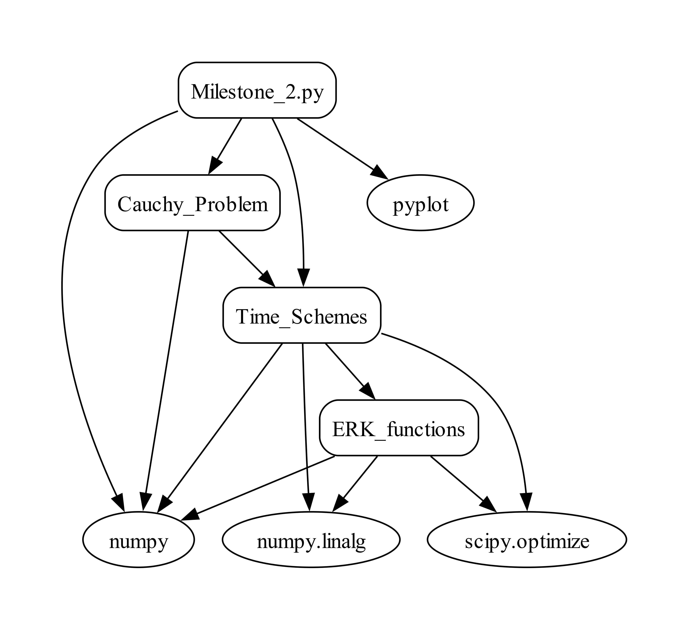

# AM1_Orbits Repository
Author: Sofía Mesón Pérez

---
This repository contains all the Python programs that I have developed during the course of "Ampliación de Matemáticas 1", during my first year of the MSc in Space Systems.
---

  

